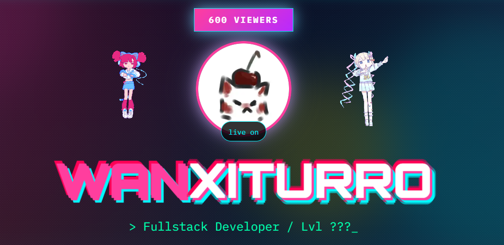

<div align="center">
  


# PORTFOLIO STYLE

### *Needy Girl Overdose / Vaporwave 80s*

[](https://nextjs.org/)
[](https://www.typescriptlang.org/)
[](https://tailwindcss.com/)
[](LICENSE)

</div>

---

## 🎮 **ABOUT THIS PROJECT**

A **glitchy, vaporwave-infused portfolio** inspired by the aesthetics of **NEEDY GIRL OVERDOSE**, **Aiobahn - INTERNET YAMERO**, and 80s anime culture. Built with love for developers who want to stand out with a unique, retro-futuristic portfolio.

> *"Code is my brush, the browser is my canvas."*

---

## ✨ **FEATURES**

| Feature | Description |
|---------|-------------|
| 🎨 **Vaporwave Aesthetic** | Neon colors, glitch effects, VHS scanlines |
| 📼 **Random Ame-chan GIFs** | Changes every time you refresh or navigate |
| 🎮 **Konami Code Easter Egg** | ↑ ↑ ↓ ↓ ← → ← → B A triggers glitch mode |
| 📱 **Mobile Blocker** | Ame-chan blocks access on unsupported screens |
| 🚫 **Custom 404 Page** | Creepy Ame-chan error page |
| 💾 **Discontinued Projects Page** | For archived projects with style |
| 🔴 **Live Stream Zone** | Simulated stream with Ame-chan |
| 🎲 **Glitch Effects** | Random VHS glitch on tab return (3% chance) |
| 🖱️ **Custom Cursor** | Retro pixel cursor support |
| 📄 **Open Source** | Free to use, modify, and customize! |

---

## 🛠️ **TECH STACK**

<div align="center">

| Category | Technologies |
|----------|--------------|
| **Framework** | Next.js 14 |
| **Language** | TypeScript |
| **Styling** | Tailwind CSS |
| **Animations** | Framer Motion |
| **Icons** | Custom SVGs + Emojis |
| **Fonts** | Orbitron, IBM Plex Mono |

</div>

---

## 🚀 **QUICK START**

### Prerequisites

- Node.js 18+ 
- npm / yarn / pnpm

### Installation

```
bash

# Clone the repository
git clone https://github.com/wanxiturro/wanxiturro-portfolio.git

# Navigate to the project
cd wanxiturro-portfolio

# Install dependencies
npm install

# Run development server
npm run dev
```

Open http://localhost:3000 and enjoy the glitch!

## 🎨 Customize

COMING SOON...

---

## 🤝 CONTRIBUTING
### This is an open-source project! Feel free to:

- Report bugs
- Suggest features
- Submit pull requests
- Share your customizations

Read [CONTRIBUTING.md]() to get started.

## 📜 License
MIT - Free to use, modify, and share!

<div align="center">
ä̞̭̲̰͈̟͚́̈̏̈ͫ̉ͮͮ͆ͨ̏ͬ͟͢ṁ͔̳ͬ̓̆͗͘e̢̧̛͇̼͚̻̼͖̥͚͔͔͇̥͕ͭ̃ͩͨ͒̇ͦ͊ͪ͋ͨ̈͋̑̂͋ͥ̂̃ͫ͐́̕͢͞͠-ͪc̷͍͚̯̰̥̯̬̩̩̤ͪ͂̒ͬ̏ͮ̽̃ͧ͐́͒ͦͪ̄͗͊̀̾ͦ͘͘͠h͕̭̱̪̪ͥ̏̅ͧ̑_̢̼̖͕̫͇͑͂ͥ̊͋̚̚ą̷̷̷̦̮̠̱̺̟͖̙̬̱̹̱͙̍̍ͭ͂̌̉ͤ̂͑͑̑͒̀ͭ̚̕͠n̶̷̨̨͇̙̦̞͔̝̲͚̯̞͔̩̜̰͎͎͈̞͎̳͓̾ͨ̓̉͛͊͌̌ͮͬ̓̒̑ͥͪ̑͘̚͟͞ i̢͓ͥ͘s̶̨̡̨̨̰̹̭͇͎͇̦̞̳͚̥̖͇̞̮̟̜̳͋̏̍̀͊̒̐̄ͯ̈ͦ͑͂̈́ͥͮ̾͜͟ w̛͈̦͈͗̊̂̿͠͡à͔̓t̶̻̝̹̥̜̱͎̹̪̿ͥ̔ͨ̓ͪ͑͂͒͞_̵̮̫̤ͪ͝ç̷̯͔͍̯̮̰̈ͤ̿̽͂ͥ͡͡h͈͙̰̲̖̃̒̉͆͌͘i̴̡̢̬̮̮̮͍̬̘̰̤ͬ̊̒̐̇ͬ̓n͘g͚̣̟̤̦͆̌ͭ͊̔.̧̣͓̣̣̙̋͆ͥ̅̍ͨ̈́.̸̷̧̧̢̨̻͙̺̬̖͖̘͍̂̊ͯͣ̾͆ͬͨ͟͞.̷̸̵̡̛̟̺͇̘̩̫̘̱̰̺̒̋̐ͮ͑̎̏̈́ͯ̂ͬ̇͐͝ 👁️
</div>